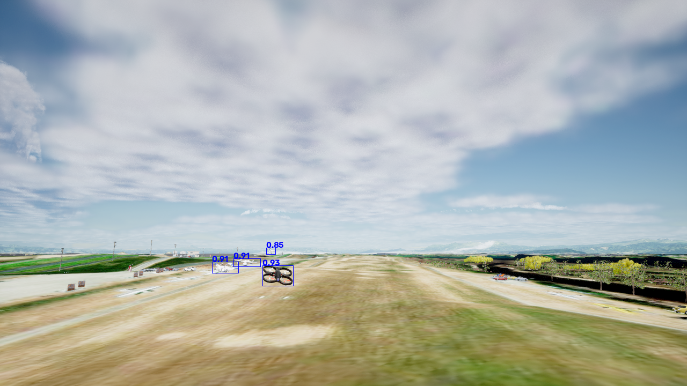

## YOLOX Deploy Test - multi-modal inputs

This repo is used to test the deployment of YOLOX model on onnxruntime and opencv with multi-modal inputs (rgb, depth).
Specifically, we provide scripts to load the YOLOX model from the onnx file and run inference on images.

### Requirements:
- onnxruntime==1.8.1
- opencv==5.0.0
- pillow==10.2.0
- numpy==1.24.4

### Usage:
1. Download the onnx model file:
   1. [end2end.onnx](https://drive.google.com/file/d/1bckuHYDEx0CnIYENlCmaKs-vZ1x3UF98/view?usp=sharing): Exported 
   pre-trained multi-modal YOLOX model that runs end-to-end (model forward pass + post-processing + NMS). 
   2. [yolox.onnx](https://drive.google.com/file/d/1Q7cL7BbDfZ7qzfQf1FcpPGF5LO8b68lo/view?usp=drive_link): Exported
    pre-trained multi-modal YOLOX model that runs (model forward pass + post-processing) without NMS.
   3. [yolox_raw.onnx](https://drive.google.com/file/d/1gbb-x2Qq_1KbPMGDVr9gvAw-iyUf4Oso/view?usp=drive_link): Exported
    pre-trained multi-modal YOLOX model that runs only the model forward pass without post-processing and NMS.
   
   __Note__: opencv currently only can load `yolox_raw.onnx` model cause the exported op set version limitation.

2. Run the test script:
   ```bash
   # run yolox_raw.onnx model on opencv
   python on_cv.py <path_to_onnx_model> data/rgb_00000.png data/disp_00000.png --show
   
   # run end2end.onnx model on onnxruntime
   python on_ort_end2end.py <path_to_onnx_model> data/rgb_00000.png data/disp_00000.png --show

   # run end2end_rgb.onnx model on onnxruntime
   python on_ort_end2end_rgb.py <path_to_onnx_model> data/rgb_00000.png --show
   
   # run yolox.onnx model on onnxruntime
   python on_ort_nms.py <path_to_onnx_model> data/rgb_00000.png data/disp_00000.png --show
   
   # run yolox_raw.onnx model on onnxruntime
   python on_ort_raw.py <path_to_onnx_model> data/rgb_00000.png data/disp_00000.png --show 

   # run yolox_raw_rgb.onnx model on onnxruntime
   python on_ort_raw_rgb.py <path_to_onnx_model> data/rgb_00000.png --show
   ``` 
   
### Results:
<p align="center">
    
</p>